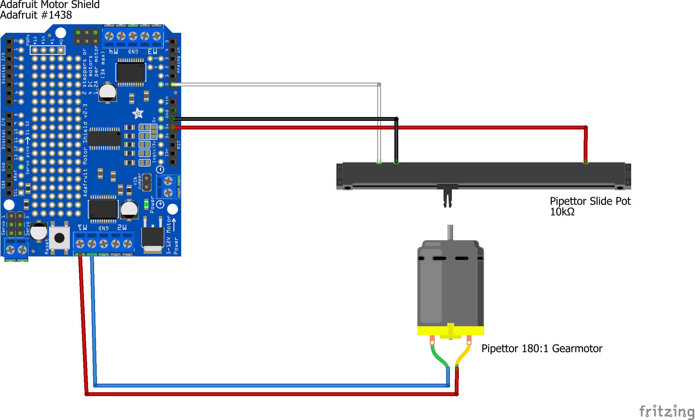

Electrical Assembly
===================

The pipettor subsystem uses a motor to move the plunger of the syringe, and a slide potentiometer to sense the position of the syringe plunger.

Potentiometer Connections
-------------------------

The potentiometer has two groups of pins. One group has a single pin at one end of the potentiometer, and the other group has a pair of pins at the opposite end of the potentiometer. The pin the single-pin group should be connected to a red wire. For the other group, the pin at the end of the potentiometer should be connected to a white wire, while the remaining pin is between the other two pins and should be connected to a black wire.

(include an image)

The white wire should be connected to Analog In pin A0 on the motor shield. The red wire should be connected to Power pin 5V on the motor shield. The black wire should be connected to Power pin GND on the motor shield.

(include an image)

Motor Connections
-----------------

When the output shaft of the motor is facing towards you and the pins of the motor are on top, the right wire should be red and the left wire should be blue or gray.

(include an image)

The red wire should be connected to the terminal on M1 which is farther from the GND terminal. The blue wire should be connected to the terminal on M1 which is closer to the GND terminal. Thus, the red wire will be closer than the blue wire to the USB port on the Arduino board.

(include an image)

